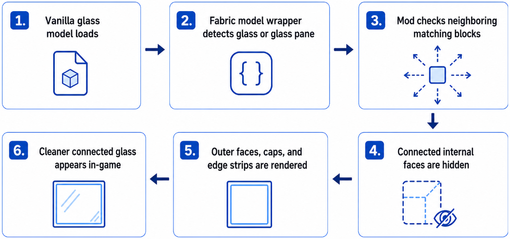

# Clean and Clear Glass

Clean and Clear Glass is a Fabric client-side mod for Minecraft Java Edition that makes vanilla glass blocks and glass panes cleaner while keeping matching glass variants visually connected.

The mod keeps the original vanilla block IDs. It does not add new glass blocks or items.

## Features

- Connected vanilla glass blocks
- Connected vanilla stained glass blocks
- Connected vanilla glass panes
- Connected vanilla stained glass panes
- Cleaner glass rendering for improved visibility
- No OptiFine required
- Uses vanilla glass and stained glass block IDs

## How It Works



Clean and Clear Glass works by wrapping Minecraft's baked vanilla glass models on the client side. When Minecraft loads a glass block or glass pane model, the mod checks nearby matching glass blocks, hides connected internal faces, and renders only the visible outer faces, caps, and edge strips. This keeps the original vanilla block IDs while making glass look cleaner and connected in-game.

## Supported Version

- Minecraft Java Edition 26.1
- Fabric Loader
- Fabric API
- Java 25

## Installation

1. Install Fabric Loader for Minecraft 26.1.
2. Install Fabric API.
3. Put the mod `.jar` file into your `mods` folder.
4. Launch the game with the Fabric profile.

## Usage & Attribution

You are allowed to make videos, reviews, tutorials, or showcases about this mod.

Please credit me as the original creator and include a link to the official download page or GitHub repository.

You are not allowed to claim this mod as your own. Reuploads, forks, or modified versions must follow the project license and the asset notice below.

## Building From Source

On Windows:

```powershell
.\gradlew.bat build
```

On macOS/Linux:

```sh
./gradlew build
```

The built `.jar` file will be available in:

```text
build/libs
```

## Asset Notice

The source code is licensed under the MIT License.

Some texture assets are edited from Minecraft's original assets to create the clean and clear glass appearance. Those texture assets are not automatically covered by the MIT License. Minecraft and its assets are owned by Mojang/Microsoft.

This project is not an official Minecraft product. It is not approved by or associated with Mojang or Microsoft.

## License

Source code is available under the MIT License. See [LICENSE](LICENSE) for details.
